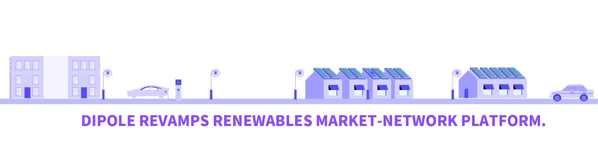
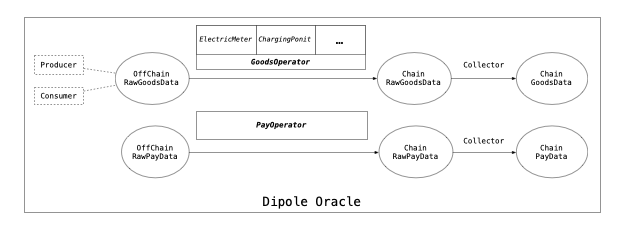
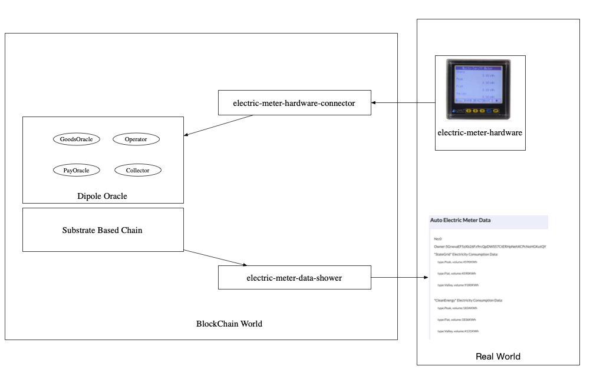
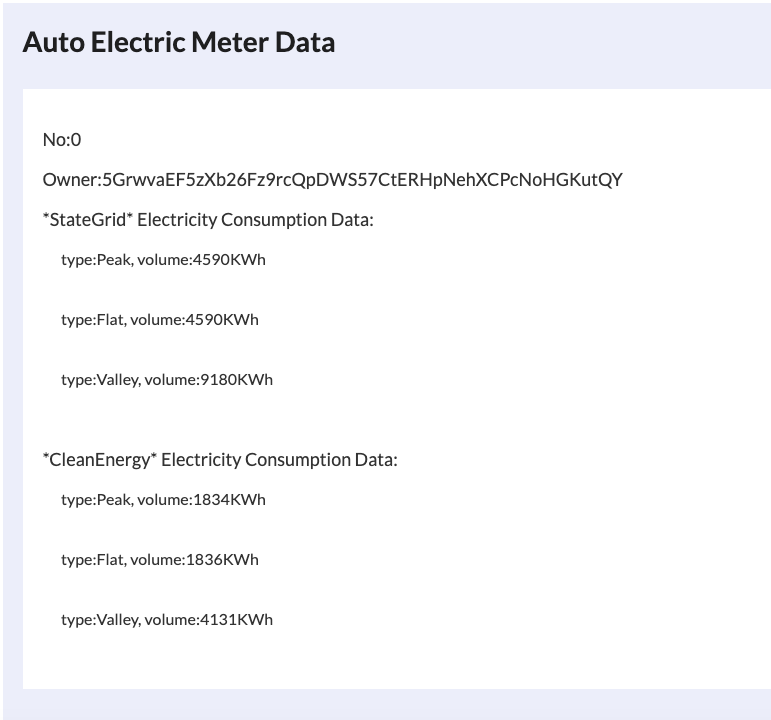

# 

# Dipole Oracle



<!-- TOC -->

- [1. Introduction](#1-introduction)
- [2. Overview](#2-overview)
- [3. Build](#3-build)
- [4. Run](#4-run)
- [5. Examples](#5-Examples)

<!-- /TOC -->

# 1. Introduction

This project is initiated and facilitated by [Dipole Tech](https://dipole.tech/). Dipole Tech is Distributed Energy Resource aggregator, providing services for the massive amount of distributed energy assets that will emerge in the future and facilitating the decarbonization of the energy system. Dipole Tech develops an independent Substrate-based blockchain which records all stages within the industry and enables interoperability from DER assets. 

The application scenarios of our system are electricity trading and energy management, and the participating users and equipment are relatively credible. Through blockchain technology, the open, transparent, and automated matching of the transaction process is guaranteed, and the energy use data is confirmed by multiple parties. The operator is responsible for installing metering equipment. In the traditional measurement process, the entire data process is controlled by the operator, and users only get the final billing result. The data and interpretation rights of the relevant measurement are all managed by the operator. In actual business scenarios, problems such as data tampering are prone to occur. If distributed energy transactions are constructed on this basis, higher costs will be required for auditing and supervision.

DipoleOracle allows the operator to only be responsible for the deployment of the equipment, instead of sealing all the data in the operator's system. The whole process of data measurement and billing is completed by multiple nodes of the alliance chain. Users can check the measurement data on the comparison chain and their own electricity consumption at any time.

DipoleOracle connects Dipole chain and offchain electrical hardware, ensure the safety and accuracy of  offchain power usage and transaction data, make them applicable for blockchain use.  Which can enrich  the ecosystem of Substrate and Polkadot, and bring  the  revolution of clean energy ecology in whole society.

Dipole Oracle aims to build a reliable and efficient platform to connect the offchain power usage data and power transaction data to blockchain service. Dipole Oracle's mission is to accelerate the clean energy ecology revolution, and enrich the ecology of [Substrate](https://substrate.dev/) and [Polkadot](https://polkadot.network/). Onchain authorization, offchain upload and exchange, fine-grained permission control for data upload and sharing，based on the unforgeable characteristics of the blockchain, the data exchange records are put on the chain to ensure that the data sovereignty can be traced in the later stage, and the dispute on the correctness of the shared data can be solved.

# 2. Overview.


DipoleOracle  includes four key components: Operator, GoodsOracle, PayOracle and Collector. The whole system provides the feeding and collecting of energy generation/consumption and transaction data.



- Operator

In the energy industry, electrical hardwares are extremely miscellaneous. The Operator module defines several common used electrical hardwares like electricity meter and charging point. The Operator module allows each registered electrical hardware to upload data online.

- GoodsOracle


In the energy industry, collecting real-time data from hardware such as electricity meter and charging piles has always been a technical challenge. DipoleGoodsOracle can be applicable to various electricity meters and protocols, which achieve a solid progress in this area.

- PayOracle


In the energy industry, periodical power transaction cause high needs of splitting bills for participants, third-party payments or stablecoins. PayOracle is able to complete all steps automatically. In area which don't have completed payment system like South Asia and Africa, PayOracle can enormously reduce the cost of payment. 

- Collector

In the energy industry, collecting energy generation/consumption and transaction data costs a lot of manpower and material resources. With the Collector module, users can easily get data they really need, which can help them customize their business scenarios.

| Component   | Description                                                | Responsibility                               | Advantage                                                    |
| ----------- | ---------------------------------------------------------- | -------------------------------------------- | ------------------------------------------------------------ |
| Operator    | connecting  off-chain hardware devices and the blockchain  | 1.register a device<br />2.device management | 1. A general connector between off-chain hardware devices and the blockchain. <br />1)In consortium blockchain sences(mostly used), especially in an electricity sales network alliance, operators' register and management should be done by the alliance manager(e.g. State Grid，Electricity Sales Service Provider ), which means it's a relatively believable environment; <br />2)In the public chain scenario, we suggest  this should be done by relatively trusted super node through applying and voting, and a trustworthy evaluation mechanism which we are working on it should be adopted in the future.<br />2.Safety and Effectiveness<br />1）In consortium blockchain sences(mostly used), especially in an electricity sales network alliance, considering the data feeding frequency(usually per 15min) and the relatively believable environment, it experiencing low risk. <br />2) Any safety control mechanism should be considerred with the [electric-meter-hardware-connector](./examples/electric-meter-hardware-connector) |
| GoodsOracle | feeding real-time data from hardware(registered operators) | 1.feeding goods data                         | 1. Feeding real-time data from (registered operators)<br />2. Data Storage.As for the metered data(mostly handled in energy scenario), it's only updating operation over old data without caring the amount of data.For example, the goods (electricity) data in the electricity trading consortium blockchain a usually contain three fields (peak/flat/valley), which allows the new data to overwrite the old data, just as the meter readings. Therefore, compare with the storage capability, data size is fully acceptable. |
| PayOracle   | feeding real-time payment data                             | 1.feeding pay data                           | 1. Feeding real-time payment data                            |
| Collector   | collecting data from goods/ pay oracle                     | 1.collecting goods/ pay data                 | 1.Collecting energy generation/consumption and transaction data, a simulation of  some offline actions, like checking out the electricity meter data <br />2. Compared to grabbing the data from the blockchain and performing calculations yourself, we makes it subdivided and integrable for different hardware service providers.According to our experience, different hardware service providers usually have different calculations and operations over hardware data, and we believe it's better to make them clear through the  Collector, and any DipoleOracle' users can use outcome and results without caring the hardware data caculation part.<br />3.Data Storage.As for the metered data(mostly handled in energy scenario), it's only caculatiing operation over old data without caring the amount of data.For example, in  electricity sales network alliance, the goods(electricity) data usually contains three field(Peak/Flat/Valley electricity data), and the collecting data usually means the difference between old and new data, and the data storage shold be acceptable. |


# 3. Build


Install Rust:

```bash
curl https://sh.rustup.rs -sSf | sh
```

Initialize your Wasm Build environment:

```bash
./scripts/init.sh
```

Build Wasm and native code:

```bash
cargo build --release
```

# 4. Run

Purge any existing developer chain state:

```bash
./target/release/dipole-oracle purge-chain --dev
```

Start a development chain with:

```bash
./target/release/dipole-oracle --dev
```

### Run in Docker

First, install [Docker](https://docs.docker.com/get-docker/) and [Docker Compose](https://docs.docker.com/compose/install/).

Then run the following command to start a single node development chain.

```bash
./scripts/docker_run.sh
```

This command will firstly compile your code, and then start a local development network. You can also replace the default command (`cargo build --release && ./target/release/dipole-oracle --dev --ws-external`) by appending your own. A few useful ones are as follow.

```bash
# Run Substrate node without re-compiling
./scripts/docker_run.sh ./target/release/dipole-oracle --dev --ws-external

# Purge the local dev chain
./scripts/docker_run.sh ./target/release/dipole-oracle purge-chain --dev

# Check whether the code is compilable
./scripts/docker_run.sh cargo check
```

# 5. Examples

An Auto Electric Meter Data Collector shows how to use Dipole Oracle with nodejs are [here](./examples/nodejs). 

[electric-meter-hardware-connector](./examples/electric-meter-hardware-connector) is a simulation of an electric meter, which sends raw electric meter data to dipole oracle chain. It shows how to register operator and send raw electric meter data. Under the real environment，developers can  refer to it to connect electric meter hardware and dipole oracle.

[electric-meter-data-shower](./examples/electric-meter-data-shower) shows user's auto electric meter data. Under the real environment，developers can refer to it to develop higher function based on the basic electric meter data.



#### 5.1 Run

1)run dipole-oralce based on Section3&4

2)run  [electric-meter-hardware-connector](./examples/electric-meter-hardware-connector/README.md)

3)run [electric-meter-data-shower](./examples/electric-meter-data-shower/README.md) 

#### 5.2 Specification

After 5.1, An Auto Electric Meter Data will be shown in http://localhost:8000/ as follows. And It will be updated automatically as the service of [electric-meter-hardware-connector](./examples/electric-meter-hardware-connector) . 



It shows electricity comsumption data of user 5GrwvaEF5zXb26Fz9rcQpDWS57CtERHpNehXCPcNoHGKutQY, which includes StateGrid and CleanEnergy electricity comsumption data.  Electricity comsumption data in three stage of Peak, Flat, and Valley are shown. 

#### 5.3 Benefits

A short comparision with  electric meter data collection using DipoleOralce before and after are as follows.

|                       | before             | After                                                        |
| --------------------- | ------------------ | ------------------------------------------------------------ |
| Electric Meter Device | hard understanding | unique DID in Blockchain Sys， easy understanding &Identifiable & traceable |
| Uploading Data        | mostly human work  | auto uploading with signature                                |
| Supervision           | hard               | easy  traceable                                              |
| Authority Control     | mostly human work  | easy realization with DID & Operator module                  |

